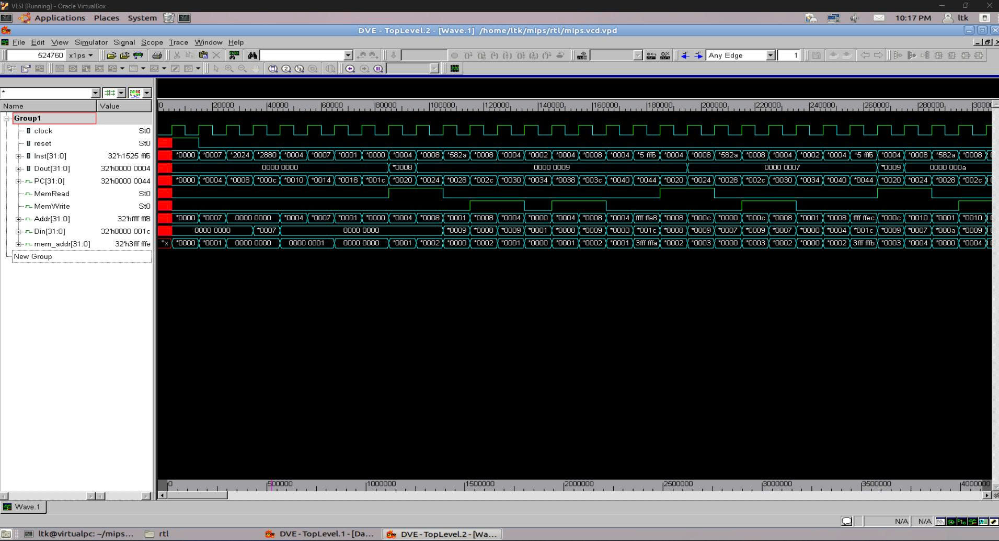
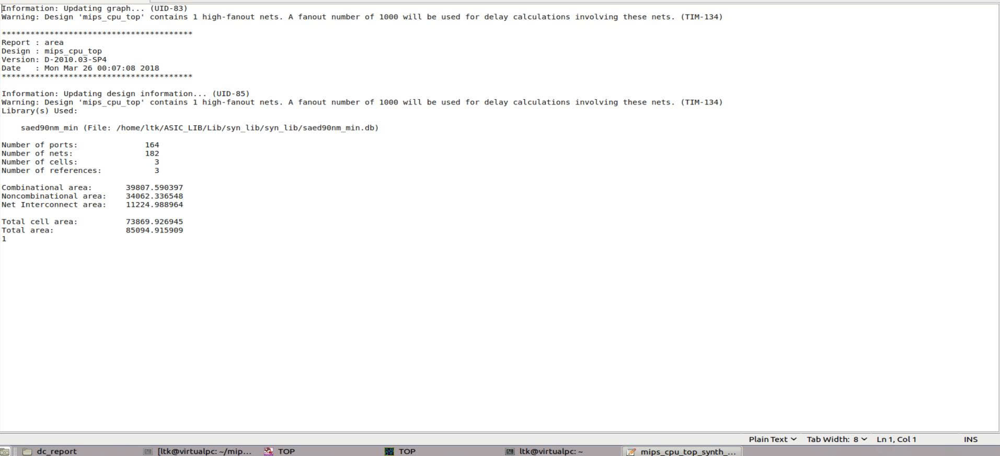
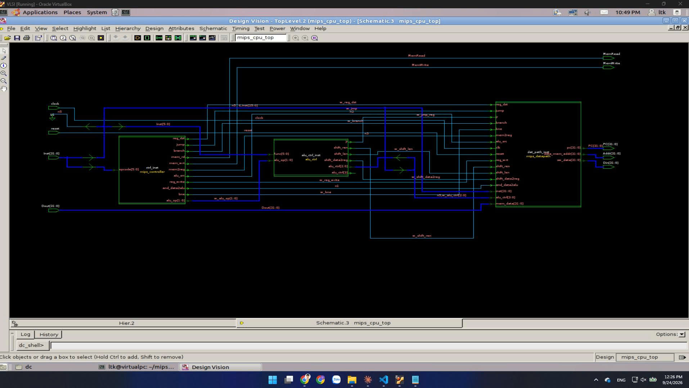
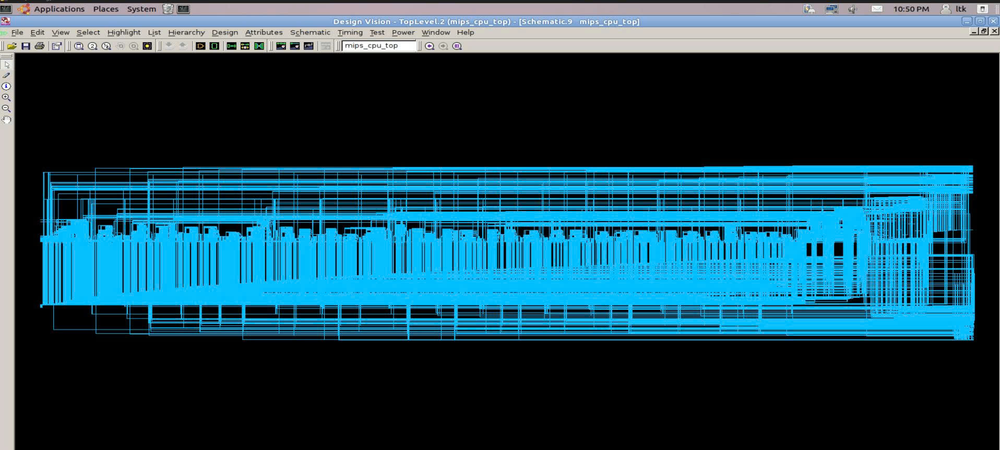
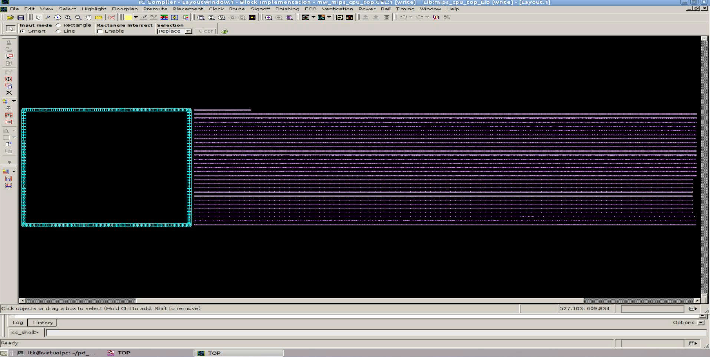
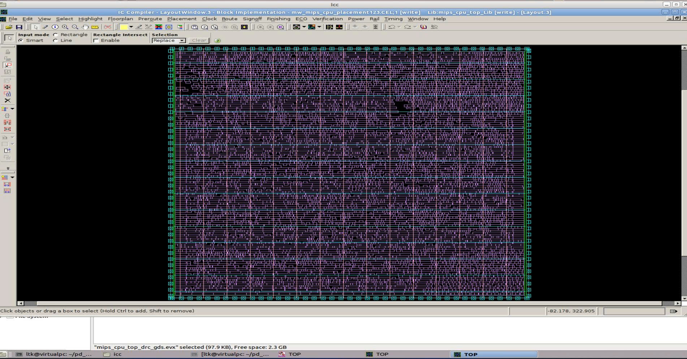
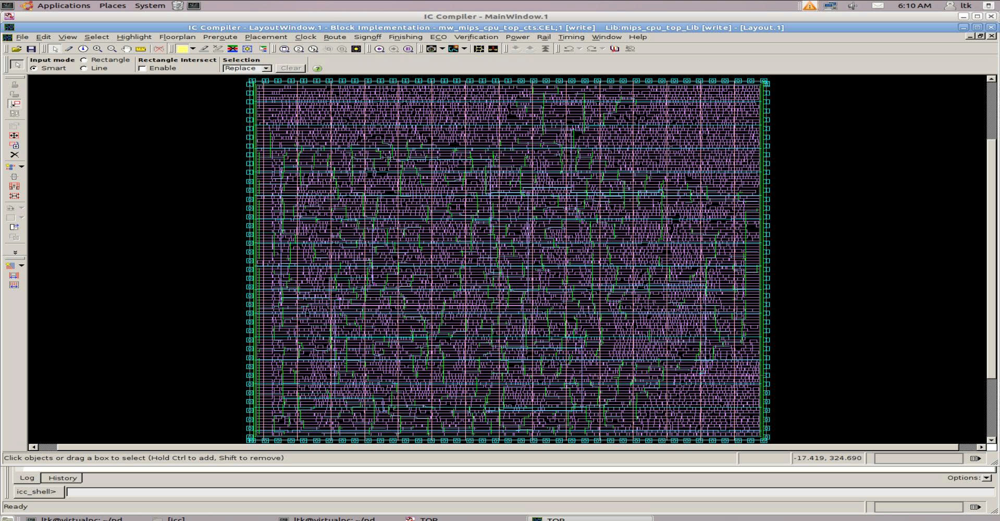
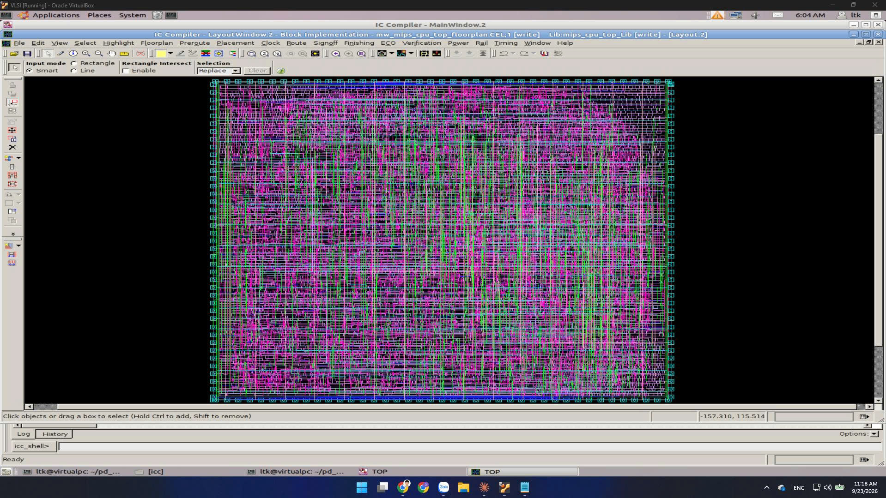
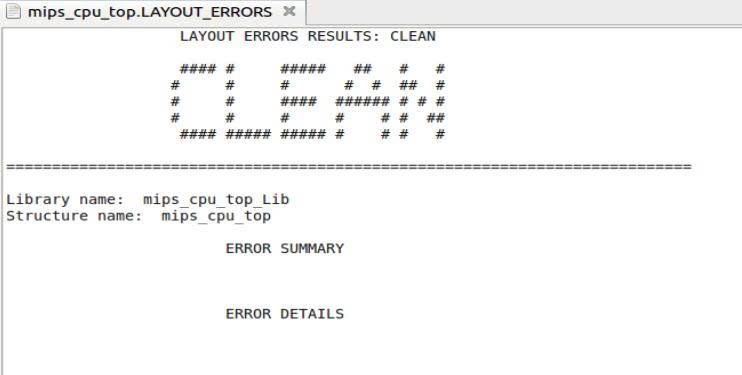

# MIPS32 Physical Design — RTL to Route

## 📌 Overview

This project implements a complete **ASIC Physical Design flow** for a single-cycle MIPS32 processor, starting from **RTL design** and progressing through **logic synthesis, floorplanning, placement, clock tree synthesis, and routing**.

The project focuses on understanding the complete RTL-to-GDSII physical implementation flow and analyzing key physical design metrics such as:

* Timing
* Area
* Standard-cell utilization
* Clock skew
* Setup/Hold violations
* Routing
* Design Rule Checking (DRC)

The implementation is performed using **Synopsys Design Compiler (DC)** and **Synopsys IC Compiler (ICC)** with a **90 nm standard-cell library**.

---

## 🏗️ Design Flow

```text
        RTL Design
            │
            ▼
       Logic Synthesis
            │
            ▼
        Floorplanning
            │
            ▼
         Placement
            │
            ▼
    Clock Tree Synthesis
            │
            ▼
         Routing
            │
            ▼
     Physical Verification
```

---

# 1. MIPS32 RTL Design

The processor is implemented as a single-cycle MIPS32 CPU.

### Main Components

* Program Counter (PC)
* Instruction Memory
* Register File
* ALU
* Control Unit
* Data Memory
* Sign Extension
* Multiplexers

### RTL Simulation

<!-- INSERT IMAGE HERE -->

<p align="center">
  
</p>

---

# 2. Logic Synthesis

The RTL is synthesized using **Synopsys Design Compiler (DC)**.

The synthesis process converts the RTL description into a gate-level netlist using the target standard-cell library.

### Target Library

* Technology: **90 nm**
* Standard-cell library: SAED90
* Operating conditions: Typical / Worst-case corners

### Synthesis Results

Important report:
<p align="center">
  
</p>


Schematic: 
<p align="center">
  
</p>
Gate-netlist:
<p align="center">
  
</p>

# 3. Floorplanning

After synthesis, the design is imported into **Synopsys IC Compiler (ICC)** for physical implementation.

The floorplanning stage defines:

* Core area
* Die area
* Core utilization
* I/O placement
* Standard-cell placement region
* Power planning region

### Floorplan Configuration

The design uses approximately **65% standard-cell utilization** before further physical optimization.

<!-- INSERT IMAGE HERE -->

<p align="center">
  
</p>

---

# 4. Placement

The next step is standard-cell placement.

ICC determines physical locations for the standard cells while optimizing:

* Timing
* Congestion
* Wirelength
* Cell density

The placement stage attempts to minimize routing complexity while maintaining timing requirements.

### Placement Result

<!-- INSERT IMAGE HERE -->

<p align="center">
  
</p>


# 5. Clock Tree Synthesis (CTS)

Clock Tree Synthesis is performed to distribute the clock signal to sequential elements across the design.

Before CTS, the clock network is idealized.

After CTS, clock buffers are inserted to control:

* Clock skew
* Clock latency
* Transition
* Fanout

### Clock Tree

<!-- INSERT IMAGE HERE -->

<p align="center">
  
</p>

### CTS Result

After clock tree synthesis:

* Clock buffers are inserted
* Clock skew is optimized
* Clock transition and fanout are controlled

Example result:

```text
Clock Period        : 20 ns
Clock Sinks         : 1056
Clock Tree Levels   : 3
CTS Buffers         : 25
Clock Skew          : ~0.0235 ns
Clock Delay         : 0.071 – 0.094 ns
MaxTran Violations  : 0
MaxCap Violations   : 0
MaxFanout Violations: 0
```

# 7. Routing

After placement and CTS, the design proceeds to routing.

The routing stage connects all placed standard cells according to the logical netlist.

The routing process includes:

* Global routing
* Track assignment
* Detailed routing
* Timing-driven routing
* Design-rule optimization

### Routing Result

<!-- INSERT IMAGE HERE -->

<p align="center">
  
</p>

---


# 8. Physical Verification

The final design is checked for physical correctness.

The verification process includes:

### DRC

Design Rule Checking verifies whether the physical layout follows the technology design rules.

<!-- INSERT IMAGE HERE -->

<p align="center">
  
</p>


---


# 10. Tools and Technology

| Category              | Tool / Technology                                     |
| --------------------- | ----------------------------------------------------- |
| HDL                   | Verilog                                               |
| Synthesis             | Synopsys Design Compiler                              |
| Physical Design       | Synopsys IC Compiler                                  |
| Technology            | 90 nm                                                 |
| Standard Cell Library | SAED90                                                |
| Simulation            | ModelSim / VCS                                        |
| Operating System      | Linux                                                 |
| Flow                  | RTL → Synthesis → Floorplan → Placement → CTS → Route |

---


